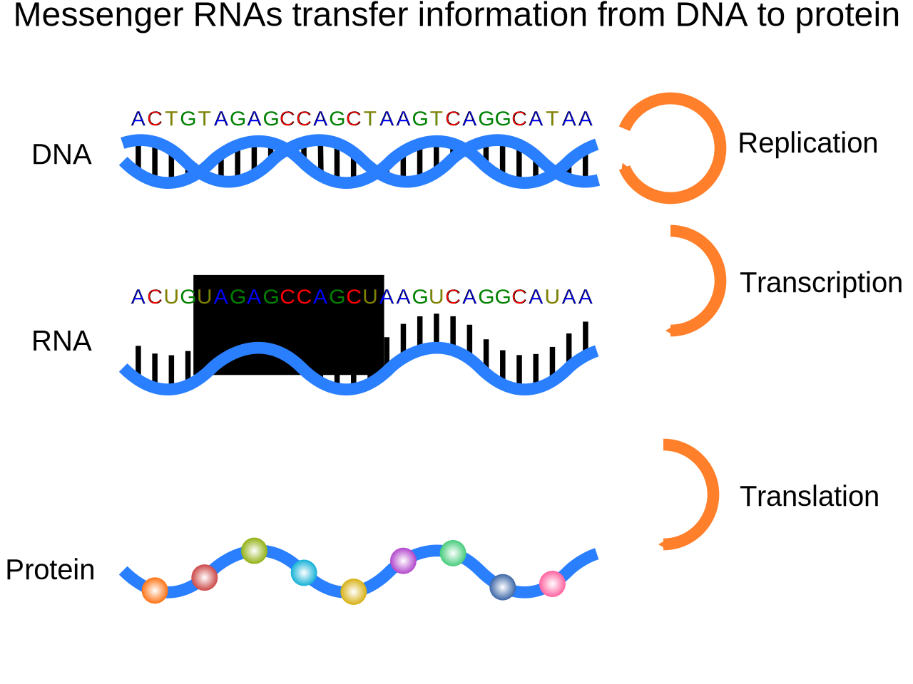

<!-- Title Slide -->

<!-- .slide: data-background="svg/title-slide.png" -->
 

<aside class="notes" data-markdown="">
- Notes for the speaker (if any).
</aside>

---

<!-- Slide 1 -->

<aside class="notes" data-markdown="">
- Speaker notes for Slide 1.
</aside>

---

<!-- Slide 2 -->

<aside class="notes" data-markdown="">
- Speaker notes for Slide 2.
</aside>

---
<!-- Summary Slide -->
# Summary

- Key point 1
- Key point 2
- Key point 3

<aside class="notes" data-markdown="">
- Wrap-up points for the presentation.
</aside>

---
<!-- Acknowledgments -->
# Acknowledgments

- Thank contributors and collaborators.
- Mention funding sources (if applicable).

<aside class="notes" data-markdown="">
- Final speaker notes or closing remarks.
</aside>
